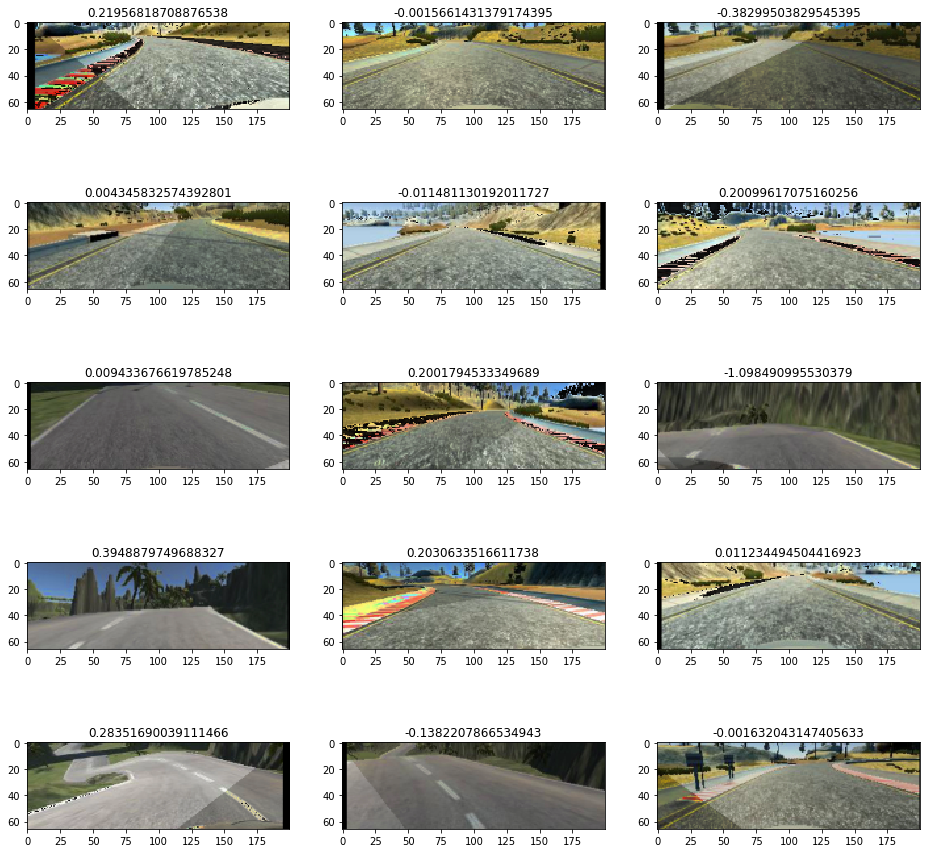
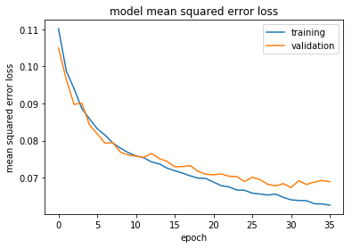

```python
%matplotlib inline
%reload_ext autoreload
%autoreload 2
```


```python
import numpy as np
import pandas as pd
import cv2
import matplotlib.pyplot as plt
import os
import time
import csv
from pathlib import Path
import sklearn
from sklearn.model_selection import train_test_split
import tensorflow as tf
from tensorflow import keras
from keras.models import Sequential
from keras.layers import Lambda, Conv2D, Flatten, Dense, Activation, Cropping2D, Dropout
from keras.callbacks import EarlyStopping, ModelCheckpoint
from keras.optimizers import Adam
from math import ceil
import utils
import augment
import model
```

    Using TensorFlow backend.


# Load the training data

Training data contains total 8 laps for each track <br> 
4 laps each in opposite direction <br> 
while 2 laps are mostly driving at the center , the other 2 laps contains <br>
data to correct to center if dragged to each of the sides. <br>


```python
cols = {0: 'Center Image', 1: 'Left Image', 2: 'Right Image', 3: 'Steering Angle', 4: 'Throttle', 5:'Break', 6:'Speed'}
track1_df = utils.read_csv_and_rename_cols('train_hd//driving_log.csv', columns=cols)
track1_df.head()
```


<div>
<style scoped>
    .dataframe tbody tr th:only-of-type {
        vertical-align: middle;
    }

    .dataframe tbody tr th {
        vertical-align: top;
    }

    .dataframe thead th {
        text-align: right;
    }
</style>
<table border="1" class="dataframe">
  <thead>
    <tr style="text-align: right;">
      <th></th>
      <th>Center Image</th>
      <th>Left Image</th>
      <th>Right Image</th>
      <th>Steering Angle</th>
      <th>Throttle</th>
      <th>Break</th>
      <th>Speed</th>
    </tr>
  </thead>
  <tbody>
    <tr>
      <th>0</th>
      <td>/AI_DEVa/autonomous_car_nd/CarND-Behavioral-Cl...</td>
      <td>/AI_DEVa/autonomous_car_nd/CarND-Behavioral-Cl...</td>
      <td>/AI_DEVa/autonomous_car_nd/CarND-Behavioral-Cl...</td>
      <td>0.0</td>
      <td>1.0</td>
      <td>0.0</td>
      <td>30.19074</td>
    </tr>
    <tr>
      <th>1</th>
      <td>/AI_DEVa/autonomous_car_nd/CarND-Behavioral-Cl...</td>
      <td>/AI_DEVa/autonomous_car_nd/CarND-Behavioral-Cl...</td>
      <td>/AI_DEVa/autonomous_car_nd/CarND-Behavioral-Cl...</td>
      <td>0.0</td>
      <td>1.0</td>
      <td>0.0</td>
      <td>30.18880</td>
    </tr>
    <tr>
      <th>2</th>
      <td>/AI_DEVa/autonomous_car_nd/CarND-Behavioral-Cl...</td>
      <td>/AI_DEVa/autonomous_car_nd/CarND-Behavioral-Cl...</td>
      <td>/AI_DEVa/autonomous_car_nd/CarND-Behavioral-Cl...</td>
      <td>0.0</td>
      <td>1.0</td>
      <td>0.0</td>
      <td>30.18910</td>
    </tr>
    <tr>
      <th>3</th>
      <td>/AI_DEVa/autonomous_car_nd/CarND-Behavioral-Cl...</td>
      <td>/AI_DEVa/autonomous_car_nd/CarND-Behavioral-Cl...</td>
      <td>/AI_DEVa/autonomous_car_nd/CarND-Behavioral-Cl...</td>
      <td>0.0</td>
      <td>1.0</td>
      <td>0.0</td>
      <td>30.18921</td>
    </tr>
    <tr>
      <th>4</th>
      <td>/AI_DEVa/autonomous_car_nd/CarND-Behavioral-Cl...</td>
      <td>/AI_DEVa/autonomous_car_nd/CarND-Behavioral-Cl...</td>
      <td>/AI_DEVa/autonomous_car_nd/CarND-Behavioral-Cl...</td>
      <td>0.0</td>
      <td>1.0</td>
      <td>0.0</td>
      <td>30.18993</td>
    </tr>
  </tbody>
</table>
</div>


```python
track1_df.shape
```


    (12208, 7)


```python
plt.figure()
track1_df['Steering Angle'].plot.hist()
```


    <matplotlib.axes._subplots.AxesSubplot at 0x7ff642443208>


As can be seen in above histogram, steering angles are concentrated around 0- 0.25 degree.<br>
There seems a bit imbalance to the left of 0<br>
We'll use some data augmentation to partly overcome this imbalance <br>

# Data Augmentation

We'll do following augmentations <br>
1) We'll randomly flip some images to keep balance of left turn and right turn <br>
2) We'll randomly adjust brightness of some pics <br>
3) We'll add some random horizontal and vertical shift and adjust the steering angle accordingly. <br>
4) We'll add some random shadow on left or right side of the image randomly<br>
<br>
<br>
We'll use all 3 images from each of the left, center and right camera.<br>
We have only steering angle for center image, we'll adjust the steering angle for left_image by adding some adjustment <br>
Similarely we'll adjust steering angle for right_image by subtracting adjustment<br>


```python
def augment_img(img, steering):
    img, steering = augment.flip(img, steering)
    img, steering = augment.random_shift(img, steering)
    img = augment.random_shadow(img)
    img = augment.adjust_brightness(img)
    return img, steering
```

# Preprocess

After Augmenting image we'll crop and resize image.<br>
We'll use the image size used in <br>
https://images.nvidia.com/content/tegra/automotive/images/2016/solutions/pdf/end-to-end-dl-using-px.pdf <br>
which is 66 * 200 * 3 in YUV. <br>


```python
def get_train_test_labels(df, left_correction= 0.0, right_correction = 0.0):
    images = []
    steering_angle_list = []
    for index, row in df.iterrows():
        left_img = utils.get_relative_path(row['Left Image'])
        right_img = utils.get_relative_path(row['Right Image'])
        center_img = utils.get_relative_path(row['Center Image'])
        angle = float(row['Steering Angle'])
        
        # Adjust the left and right steering angle
        langle = angle + left_correction
        rangle = angle - right_correction
        
        # Read Image
        limg = utils.read_img(left_img)
        cimg = utils.read_img(center_img)
        rimg = utils.read_img(right_img)
        
        # Augment the Image
        limg, langle = augment_img(limg, langle)
        cimg, angle = augment_img(cimg, angle)
        rimg, rangle = augment_img(rimg, rangle)
        
        # Preprocess the augmented images to feed to model
        limg = utils.preprocess(limg)
        cimg = utils.preprocess(cimg)
        rimg = utils.preprocess(rimg)
        
        images.append(limg)
        steering_angle_list.append(langle)
        images.append(cimg)
        steering_angle_list.append(angle)
        images.append(rimg)
        steering_angle_list.append(rangle)
        
    return images, steering_angle_list
```


```python
def generator(df, bs=32):
    total = len(df)
    while 1:
        sklearn.utils.shuffle(df)
        for offset in range(0, total, bs):
            batch = df[offset:offset+bs]
            images, angles = get_train_test_labels(batch, 0.2, 0.2)
            
            X_train = np.array(images)
            y_train = np.array(angles)
            yield sklearn.utils.shuffle(X_train, y_train)
```


```python
train_samples, valid_samples = train_test_split(track1_df, test_size=0.2)
```


```python
train_generator = generator(train_samples)
valid_generator = generator(valid_samples)
```

# Display Images and Steering angle


```python
next_batch = []

for batch in train_generator:
    next_batch = batch
    break

utils.display_multiple_images(next_batch[0][:15], next_batch[1][:15])
```





# Model


```python
optimizer=Adam(1e-4, decay=0.0)
```

    WARNING:tensorflow:From /home/nachiket273/anaconda3/envs/tensorflow/lib/python3.7/site-packages/tensorflow/python/framework/op_def_library.py:263: colocate_with (from tensorflow.python.framework.ops) is deprecated and will be removed in a future version.
    Instructions for updating:
    Colocations handled automatically by placer.


```python
model = model.get_model(optimizer)
```


```python
es = EarlyStopping(monitor='val_loss', mode='auto', verbose=1, patience=5)
cp = ModelCheckpoint('model_best_fit.h5', monitor='val_loss', verbose=1, save_best_only=True, mode='auto')
```


```python
history = model.fit_generator(train_generator, 
                    steps_per_epoch= ceil(len(train_samples)/32),
                    validation_data=valid_generator, 
                    validation_steps= ceil(len(valid_samples)/32),
                    epochs=40, callbacks=[es, cp])
```

    WARNING:tensorflow:From /home/nachiket273/anaconda3/envs/tensorflow/lib/python3.7/site-packages/tensorflow/python/ops/math_ops.py:3066: to_int32 (from tensorflow.python.ops.math_ops) is deprecated and will be removed in a future version.
    Instructions for updating:
    Use tf.cast instead.
    Epoch 1/40
    306/306 [==============================] - 422s 1s/step - loss: 0.1100 - val_loss: 0.1049
    
    Epoch 00001: val_loss improved from inf to 0.10489, saving model to model_best_fit.h5
    Epoch 2/40
    306/306 [==============================] - 164s 535ms/step - loss: 0.0986 - val_loss: 0.0965
    
    Epoch 00002: val_loss improved from 0.10489 to 0.09647, saving model to model_best_fit.h5
    Epoch 3/40
    306/306 [==============================] - 164s 535ms/step - loss: 0.0939 - val_loss: 0.0898
    
    Epoch 00003: val_loss improved from 0.09647 to 0.08978, saving model to model_best_fit.h5
    Epoch 4/40
    306/306 [==============================] - 165s 538ms/step - loss: 0.0885 - val_loss: 0.0901
    
    Epoch 00004: val_loss did not improve from 0.08978
    Epoch 5/40
    306/306 [==============================] - 162s 529ms/step - loss: 0.0858 - val_loss: 0.0842
    
    Epoch 00005: val_loss improved from 0.08978 to 0.08424, saving model to model_best_fit.h5
    Epoch 6/40
    306/306 [==============================] - 157s 513ms/step - loss: 0.0831 - val_loss: 0.0818
    
    Epoch 00006: val_loss improved from 0.08424 to 0.08183, saving model to model_best_fit.h5
    Epoch 7/40
    306/306 [==============================] - 164s 534ms/step - loss: 0.0813 - val_loss: 0.0793
    
    Epoch 00007: val_loss improved from 0.08183 to 0.07933, saving model to model_best_fit.h5
    Epoch 8/40
    306/306 [==============================] - 161s 527ms/step - loss: 0.0793 - val_loss: 0.0795
    
    Epoch 00008: val_loss did not improve from 0.07933
    Epoch 9/40
    306/306 [==============================] - 163s 532ms/step - loss: 0.0778 - val_loss: 0.0769
    
    Epoch 00009: val_loss improved from 0.07933 to 0.07690, saving model to model_best_fit.h5
    Epoch 10/40
    306/306 [==============================] - 166s 543ms/step - loss: 0.0766 - val_loss: 0.0761
    
    Epoch 00010: val_loss improved from 0.07690 to 0.07613, saving model to model_best_fit.h5
    Epoch 11/40
    306/306 [==============================] - 165s 540ms/step - loss: 0.0758 - val_loss: 0.0758
    
    Epoch 00011: val_loss improved from 0.07613 to 0.07582, saving model to model_best_fit.h5
    Epoch 12/40
    306/306 [==============================] - 166s 544ms/step - loss: 0.0753 - val_loss: 0.0755
    
    Epoch 00012: val_loss improved from 0.07582 to 0.07549, saving model to model_best_fit.h5
    Epoch 13/40
    306/306 [==============================] - 164s 538ms/step - loss: 0.0741 - val_loss: 0.0766
    
    Epoch 00013: val_loss did not improve from 0.07549
    Epoch 14/40
    306/306 [==============================] - 161s 525ms/step - loss: 0.0736 - val_loss: 0.0752
    
    Epoch 00014: val_loss improved from 0.07549 to 0.07521, saving model to model_best_fit.h5
    Epoch 15/40
    306/306 [==============================] - 159s 519ms/step - loss: 0.0725 - val_loss: 0.0744
    
    Epoch 00015: val_loss improved from 0.07521 to 0.07440, saving model to model_best_fit.h5
    Epoch 16/40
    306/306 [==============================] - 157s 515ms/step - loss: 0.0718 - val_loss: 0.0730
    
    Epoch 00016: val_loss improved from 0.07440 to 0.07298, saving model to model_best_fit.h5
    Epoch 17/40
    306/306 [==============================] - 159s 521ms/step - loss: 0.0711 - val_loss: 0.0730
    
    Epoch 00017: val_loss did not improve from 0.07298
    Epoch 18/40
    306/306 [==============================] - 162s 528ms/step - loss: 0.0704 - val_loss: 0.0733
    
    Epoch 00018: val_loss did not improve from 0.07298
    Epoch 19/40
    306/306 [==============================] - 165s 538ms/step - loss: 0.0698 - val_loss: 0.0718
    
    Epoch 00019: val_loss improved from 0.07298 to 0.07177, saving model to model_best_fit.h5
    Epoch 20/40
    306/306 [==============================] - 160s 524ms/step - loss: 0.0697 - val_loss: 0.0710
    
    Epoch 00020: val_loss improved from 0.07177 to 0.07095, saving model to model_best_fit.h5
    Epoch 21/40
    306/306 [==============================] - 232s 758ms/step - loss: 0.0687 - val_loss: 0.0708
    
    Epoch 00021: val_loss improved from 0.07095 to 0.07081, saving model to model_best_fit.h5
    Epoch 22/40
    306/306 [==============================] - 179s 584ms/step - loss: 0.0678 - val_loss: 0.0711
    
    Epoch 00022: val_loss did not improve from 0.07081
    Epoch 23/40
    306/306 [==============================] - 163s 532ms/step - loss: 0.0674 - val_loss: 0.0704
    
    Epoch 00023: val_loss improved from 0.07081 to 0.07041, saving model to model_best_fit.h5
    Epoch 24/40
    306/306 [==============================] - 166s 543ms/step - loss: 0.0666 - val_loss: 0.0703
    
    Epoch 00024: val_loss improved from 0.07041 to 0.07032, saving model to model_best_fit.h5
    Epoch 25/40
    306/306 [==============================] - 157s 512ms/step - loss: 0.0665 - val_loss: 0.0690
    
    Epoch 00025: val_loss improved from 0.07032 to 0.06901, saving model to model_best_fit.h5
    Epoch 26/40
    306/306 [==============================] - 159s 519ms/step - loss: 0.0658 - val_loss: 0.0701
    
    Epoch 00026: val_loss did not improve from 0.06901
    Epoch 27/40
    306/306 [==============================] - 161s 527ms/step - loss: 0.0655 - val_loss: 0.0695
    
    Epoch 00027: val_loss did not improve from 0.06901
    Epoch 28/40
    306/306 [==============================] - 157s 512ms/step - loss: 0.0653 - val_loss: 0.0683
    
    Epoch 00028: val_loss improved from 0.06901 to 0.06825, saving model to model_best_fit.h5
    Epoch 29/40
    306/306 [==============================] - 156s 511ms/step - loss: 0.0655 - val_loss: 0.0678
    
    Epoch 00029: val_loss improved from 0.06825 to 0.06784, saving model to model_best_fit.h5
    Epoch 30/40
    306/306 [==============================] - 159s 521ms/step - loss: 0.0646 - val_loss: 0.0684
    
    Epoch 00030: val_loss did not improve from 0.06784
    Epoch 31/40
    306/306 [==============================] - 157s 512ms/step - loss: 0.0640 - val_loss: 0.0674
    
    Epoch 00031: val_loss improved from 0.06784 to 0.06740, saving model to model_best_fit.h5
    Epoch 32/40
    306/306 [==============================] - 158s 515ms/step - loss: 0.0638 - val_loss: 0.0692
    
    Epoch 00032: val_loss did not improve from 0.06740
    Epoch 33/40
    306/306 [==============================] - 166s 542ms/step - loss: 0.0638 - val_loss: 0.0682
    
    Epoch 00033: val_loss did not improve from 0.06740
    Epoch 34/40
    306/306 [==============================] - 165s 541ms/step - loss: 0.0629 - val_loss: 0.0688
    
    Epoch 00034: val_loss did not improve from 0.06740
    Epoch 35/40
    306/306 [==============================] - 162s 531ms/step - loss: 0.0629 - val_loss: 0.0693
    
    Epoch 00035: val_loss did not improve from 0.06740
    Epoch 36/40
    306/306 [==============================] - 161s 525ms/step - loss: 0.0625 - val_loss: 0.0689
    
    Epoch 00036: val_loss did not improve from 0.06740
    Epoch 00036: early stopping


```python
plt.plot(history.history['loss'])
plt.plot(history.history['val_loss'])
plt.title('model mean squared error loss')
plt.ylabel('mean squared error loss')
plt.xlabel('epoch')
plt.legend(['training', 'validation'], loc='upper right')
plt.show()
```




