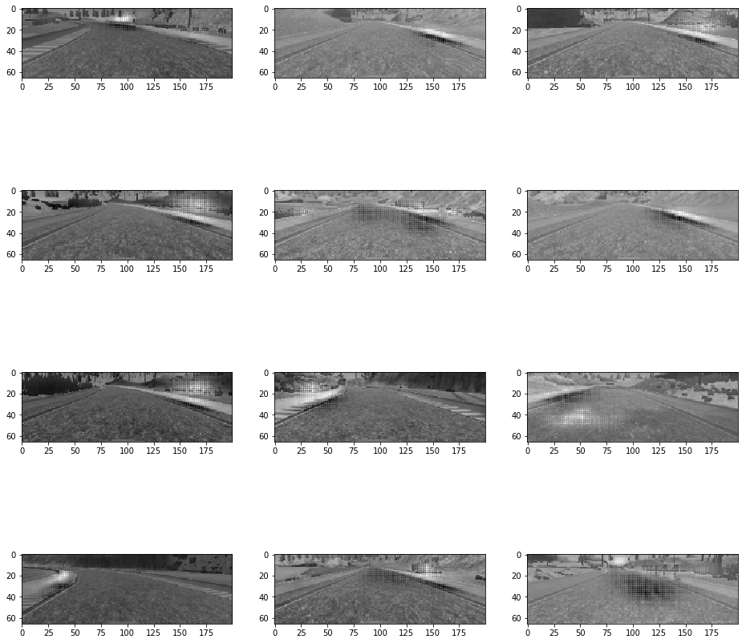

This notebook kind of implementation of paper (https://arxiv.org/pdf/1704.07911.pdf) which explains how a deep neural network trained with end-to-end learning steers a car. <br>
<br>
This paper explains a method to find salient features that neural network considers while taking the decisions of steering.<br>

# Method to extract salient features

1) In each layer, activations of the feature maps are averaged. <br>
2) The top most averaged map is scaled up to the size of the map of the layer below. <br>
The upscaling is done using deconvolution. The kernel size and stride are chosen same as <br>
in the convolutional layer used to generate the map.<br>
3) The up-scaled averaged map from an upper level is then multiplied with the averaged map <br>
from the layer below. <br>
4) Repeat steps 2 and 3 till until the input is reached. <br>
5) The last mask which is of the size of the input image is <br>
normalized to the range from 0.0 to 1.0. <br>
<br>
<br>
Now this is visualisation map and shows which regions of the input image <br>
contribute most to the output of the network <br>


```python
%matplotlib inline
%reload_ext autoreload
%autoreload 2
```


```python
from tqdm import tnrange
import matplotlib.pyplot as plt
import tensorflow as tf
from keras import backend as K
from keras.optimizers import Adam
import utils
import model
import numpy as np
import cv2
import os
```

    Using TensorFlow backend.


```python
optimizer=Adam(1e-4, decay=0.0)
```

    WARNING:tensorflow:From /home/nachiket273/anaconda3/envs/tensorflow/lib/python3.7/site-packages/tensorflow/python/framework/op_def_library.py:263: colocate_with (from tensorflow.python.framework.ops) is deprecated and will be removed in a future version.
    Instructions for updating:
    Colocations handled automatically by placer.


```python
model = model.get_model(optimizer)
model.load_weights('model_best_fit.h5')
```

    WARNING:tensorflow:From /home/nachiket273/anaconda3/envs/tensorflow/lib/python3.7/site-packages/keras/backend/tensorflow_backend.py:3445: calling dropout (from tensorflow.python.ops.nn_ops) with keep_prob is deprecated and will be removed in a future version.
    Instructions for updating:
    Please use `rate` instead of `keep_prob`. Rate should be set to `rate = 1 - keep_prob`.


```python
outputs = [layer.output for layer in model.layers][1:6]
inputs = model.input
functor = K.function([inputs], outputs)
```


```python
filenames = []

for filename in os.listdir('run1'):
    filenames.append(os.path.join('run1', filename))
```


```python
images =[]
alpha = 0.002
beta = 1.0 - alpha

for i  in tnrange(len(filenames), desc='files'):
    if i > 499 :
        break
    img = utils.read_img(filenames[i])
    proc_img = utils.preprocess(img)
    img = img[40:-20, :, :]
    img = cv2.resize(img, (utils.IMG_WIDTH, utils.IMG_HT), cv2.INTER_AREA)
    layer_outs = functor([img.reshape(1, utils.IMG_HT, utils.IMG_WIDTH, utils.IMG_CH)])
    img = cv2.cvtColor(img, cv2.COLOR_RGB2GRAY)
    mask = utils.get_salient_feature_mask(layer_outs)
    #stacked_mask = np.dstack((np.dstack((mask, mask)), mask))
    mask_img = cv2.addWeighted(img.astype('float32'), alpha, mask, beta, 0.0)
    norm_img = (mask_img - np.min(mask_img)) / (np.max(mask_img) - np.min(mask_img))
    images.append(norm_img)
```


    HBox(children=(IntProgress(value=0, description='files', max=4993, style=ProgressStyle(description_width='init…


```python
utils.display_multiple_images(images[:12], is_yuv=False, cmap='gray')
```





```python

```
