# Self-Driving Car Engineer Nanodegree

## Deep Learning

## Project: Build a Traffic Sign Recognition Classifier

In this notebook, a template is provided for you to implement your functionality in stages, which is required to successfully complete this project. If additional code is required that cannot be included in the notebook, be sure that the Python code is successfully imported and included in your submission if necessary. 

> **Note**: Once you have completed all of the code implementations, you need to finalize your work by exporting the iPython Notebook as an HTML document. Before exporting the notebook to html, all of the code cells need to have been run so that reviewers can see the final implementation and output. You can then export the notebook by using the menu above and navigating to  \n",
    "**File -> Download as -> HTML (.html)**. Include the finished document along with this notebook as your submission. 

In addition to implementing code, there is a writeup to complete. The writeup should be completed in a separate file, which can be either a markdown file or a pdf document. There is a [write up template](https://github.com/udacity/CarND-Traffic-Sign-Classifier-Project/blob/master/writeup_template.md) that can be used to guide the writing process. Completing the code template and writeup template will cover all of the [rubric points](https://review.udacity.com/#!/rubrics/481/view) for this project.

The [rubric](https://review.udacity.com/#!/rubrics/481/view) contains "Stand Out Suggestions" for enhancing the project beyond the minimum requirements. The stand out suggestions are optional. If you decide to pursue the "stand out suggestions", you can include the code in this Ipython notebook and also discuss the results in the writeup file.


>**Note:** Code and Markdown cells can be executed using the **Shift + Enter** keyboard shortcut. In addition, Markdown cells can be edited by typically double-clicking the cell to enter edit mode.

---
## Step 0: Load The Data


```python
import matplotlib.pyplot as plt
import pickle
import numpy as np
import csv
import random
import cv2
import tensorflow as tf
from sklearn.utils import shuffle
```


```python
%matplotlib inline
```


```python
# TODO: Fill this in based on where you saved the training and testing data
training_file = 'data/train.p'
validation_file= 'data/valid.p'
testing_file = 'data/test.p'

with open(training_file, mode='rb') as f:
    train = pickle.load(f)
with open(validation_file, mode='rb') as f:
    valid = pickle.load(f)
with open(testing_file, mode='rb') as f:
    test = pickle.load(f)
    
X_train, y_train = train['features'], train['labels']
X_valid, y_valid = valid['features'], valid['labels']
X_test, y_test = test['features'], test['labels']
```

---

## Step 1: Dataset Summary & Exploration

The pickled data is a dictionary with 4 key/value pairs:

- `'features'` is a 4D array containing raw pixel data of the traffic sign images, (num examples, width, height, channels).
- `'labels'` is a 1D array containing the label/class id of the traffic sign. The file `signnames.csv` contains id -> name mappings for each id.
- `'sizes'` is a list containing tuples, (width, height) representing the original width and height the image.
- `'coords'` is a list containing tuples, (x1, y1, x2, y2) representing coordinates of a bounding box around the sign in the image. **THESE COORDINATES ASSUME THE ORIGINAL IMAGE. THE PICKLED DATA CONTAINS RESIZED VERSIONS (32 by 32) OF THESE IMAGES**

Complete the basic data summary below. Use python, numpy and/or pandas methods to calculate the data summary rather than hard coding the results. For example, the [pandas shape method](http://pandas.pydata.org/pandas-docs/stable/generated/pandas.DataFrame.shape.html) might be useful for calculating some of the summary results. 

### Provide a Basic Summary of the Data Set Using Python, Numpy and/or Pandas


```python
### Replace each question mark with the appropriate value. 
### Use python, pandas or numpy methods rather than hard coding the results
# TODO: Number of training examples
n_train = X_train.shape[0]

# TODO: Number of validation examples
n_validation = X_valid.shape[0]

# TODO: Number of testing examples.
n_test = X_test.shape[0]

# TODO: What's the shape of an traffic sign image?
image_shape = X_train.shape[1:]

# TODO: How many unique classes/labels there are in the dataset.
n_classes = len(np.unique(y_train))

print("Number of training examples =", n_train)
print("Number of validation examples =", n_validation)
print("Number of testing examples =", n_test)
print("Image data shape =", image_shape)
print("Number of classes =", n_classes)
```

    Number of training examples = 34799
    Number of validation examples = 4410
    Number of testing examples = 12630
    Image data shape = (32, 32, 3)
    Number of classes = 43


```python
id_to_sign_names = dict()

with open('signnames.csv', 'r') as csvfile:
    reader = csv.reader(csvfile, delimiter=',')
    next(reader)
    id_to_sign_names = {int(row[0]):row[1] for row in reader}
    csvfile.close()
```


```python
id_to_sign_names
```


    {0: 'Speed limit (20km/h)',
     1: 'Speed limit (30km/h)',
     2: 'Speed limit (50km/h)',
     3: 'Speed limit (60km/h)',
     4: 'Speed limit (70km/h)',
     5: 'Speed limit (80km/h)',
     6: 'End of speed limit (80km/h)',
     7: 'Speed limit (100km/h)',
     8: 'Speed limit (120km/h)',
     9: 'No passing',
     10: 'No passing for vehicles over 3.5 metric tons',
     11: 'Right-of-way at the next intersection',
     12: 'Priority road',
     13: 'Yield',
     14: 'Stop',
     15: 'No vehicles',
     16: 'Vehicles over 3.5 metric tons prohibited',
     17: 'No entry',
     18: 'General caution',
     19: 'Dangerous curve to the left',
     20: 'Dangerous curve to the right',
     21: 'Double curve',
     22: 'Bumpy road',
     23: 'Slippery road',
     24: 'Road narrows on the right',
     25: 'Road work',
     26: 'Traffic signals',
     27: 'Pedestrians',
     28: 'Children crossing',
     29: 'Bicycles crossing',
     30: 'Beware of ice/snow',
     31: 'Wild animals crossing',
     32: 'End of all speed and passing limits',
     33: 'Turn right ahead',
     34: 'Turn left ahead',
     35: 'Ahead only',
     36: 'Go straight or right',
     37: 'Go straight or left',
     38: 'Keep right',
     39: 'Keep left',
     40: 'Roundabout mandatory',
     41: 'End of no passing',
     42: 'End of no passing by vehicles over 3.5 metric tons'}


```python
def draw_hist(dataset, label, num_classes):
    hist, bins = np.histogram(dataset, bins=num_classes)
    width = 0.8 * (bins[1] - bins[0])
    center = (bins[:-1] + bins[1:]) / 2
    plt.bar(center, hist, align='center', width=width)
    plt.xlabel(label)
    plt.ylabel("Count")
    plt.show()
```

Looking at histogram below, the number of examples per class seems to be skewed<br>
Like few classes have less than 250 training examples amd few have around 2000<br>


```python
draw_hist(y_train, "Training", n_classes)
draw_hist(y_valid, "Valid", n_classes)
draw_hist(y_test, "Test", n_classes)
```


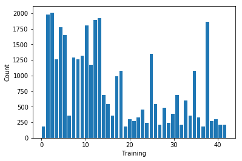


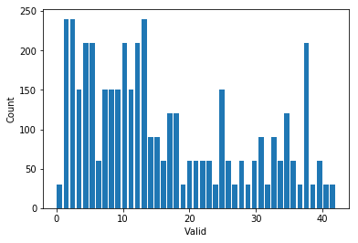


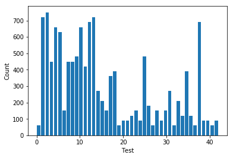


```python
hist, bins = np.histogram(y_train, bins=n_classes)
plt.hist(y_train, bins, color='red', label='Train')
plt.hist(y_test, bins, color='blue', label='Test')
plt.hist(y_valid, bins, color='yellow', label='Valid')
plt.legend(loc='upper right')
plt.show()
```


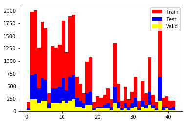


### Include an exploratory visualization of the dataset

Visualize the German Traffic Signs Dataset using the pickled file(s). This is open ended, suggestions include: plotting traffic sign images, plotting the count of each sign, etc. 

The [Matplotlib](http://matplotlib.org/) [examples](http://matplotlib.org/examples/index.html) and [gallery](http://matplotlib.org/gallery.html) pages are a great resource for doing visualizations in Python.

**NOTE:** It's recommended you start with something simple first. If you wish to do more, come back to it after you've completed the rest of the sections. It can be interesting to look at the distribution of classes in the training, validation and test set. Is the distribution the same? Are there more examples of some classes than others?


```python
def display(img, label, cmap=''):
    plt.figure(figsize=(2,2))
    plt.title(id_to_sign_names[label])
    if cmap != '':
        plt.imshow(image, cmap=cmap)
    else:
        plt.imshow(image)
```


```python
index = random.randint(0, len(X_train))
image = X_train[index].squeeze()
label = y_train[index]
display(image, label)
```


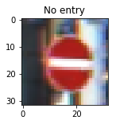


```python
def display_mult(img_list, label_list, pred_list=[], columns=4, rows=5, cmap=''):        
    fig = plt.figure(figsize=(16,16));
    for i in range(1, columns*rows +1):
        fig.add_subplot(rows, columns, i)       
        img = img_list[i-1]
        title =''
        if len(pred_list) > 0 :
            title = 'A:' + str(id_to_sign_names[label_list[i-1]])
            title += '\n/P:' + str(id_to_sign_names[pred_list[i-1]])
        else:
            title = id_to_sign_names[label_list[i-1]]
        plt.title(title)
        plt.axis('off')
        if cmap != '':
            plt.imshow(img, cmap=cmap)
        else:
            plt.imshow(img)
    plt.show()
```


```python
image_list = list()
label_list = list()
for i in range(20):
    indx = random.randint(0, len(X_train))
    image_list.append(X_train[indx])
    label_list.append(y_train[indx])

display_mult(image_list, label_list)
```


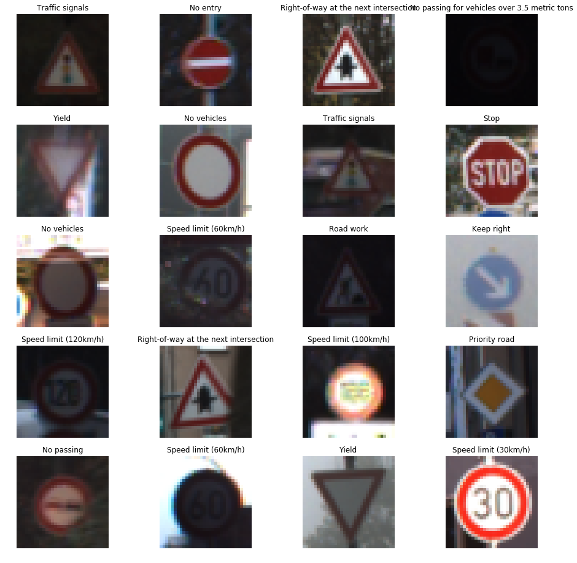


----

## Step 2: Design and Test a Model Architecture

Design and implement a deep learning model that learns to recognize traffic signs. Train and test your model on the [German Traffic Sign Dataset](http://benchmark.ini.rub.de/?section=gtsrb&subsection=dataset).

The LeNet-5 implementation shown in the [classroom](https://classroom.udacity.com/nanodegrees/nd013/parts/fbf77062-5703-404e-b60c-95b78b2f3f9e/modules/6df7ae49-c61c-4bb2-a23e-6527e69209ec/lessons/601ae704-1035-4287-8b11-e2c2716217ad/concepts/d4aca031-508f-4e0b-b493-e7b706120f81) at the end of the CNN lesson is a solid starting point. You'll have to change the number of classes and possibly the preprocessing, but aside from that it's plug and play! 

With the LeNet-5 solution from the lecture, you should expect a validation set accuracy of about 0.89. To meet specifications, the validation set accuracy will need to be at least 0.93. It is possible to get an even higher accuracy, but 0.93 is the minimum for a successful project submission. 

There are various aspects to consider when thinking about this problem:

- Neural network architecture (is the network over or underfitting?)
- Play around preprocessing techniques (normalization, rgb to grayscale, etc)
- Number of examples per label (some have more than others).
- Generate fake data.

Here is an example of a [published baseline model on this problem](http://yann.lecun.com/exdb/publis/pdf/sermanet-ijcnn-11.pdf). It's not required to be familiar with the approach used in the paper but, it's good practice to try to read papers like these.

### Pre-process the Data Set (normalization, grayscale, etc.)

Minimally, the image data should be normalized so that the data has mean zero and equal variance. For image data, `(pixel - 128)/ 128` is a quick way to approximately normalize the data and can be used in this project. 

Other pre-processing steps are optional. You can try different techniques to see if it improves performance. 

Use the code cell (or multiple code cells, if necessary) to implement the first step of your project.

# Gray Scale

As a part of preprocessing converting image to gray-scale, as there is no need to have traffic sign <br>
in color. so convert the image into grayscale image <br>


```python
def gray_scale(img):
    return cv2.cvtColor(img, cv2.COLOR_RGB2GRAY)
```

# Normalize the image

Image is normalised by subtracting mean  and dividing by standard deviation <br> causing image pixels to be in range [0,1] <br>


```python
def normalize(img):
    return ((img - np.mean(img))/ np.std(img))
```

# Equalize histogram

As can be seen from above displayed images some images are too bright or some are too dark. <br>
Usually these images will have pixel values concentrated at high or low region <br>
A good image will have a histogram which will have pixel values spread across. <br>
The equalize histogram does the same for us <br>


```python
def equalize(img):
    return cv2.equalizeHist(img)
```

# CLAHE histogram

Global Equalization considers global contrasts. But its not good idea everytime. <br>
CLAHE histogram uses adaptive histogram equalization. It divides the image into smaller tiles <br>
and applies equalization on those tiles. Notice that these tiles are small (8x8 pixel by default) <br>
and if these tiles contain noise, applying equalization will increase noise, so contrast limiting <br>
is also applied.  After equalization, to remove artifacts in tile borders, bilinear interpolation is applied <br>


```python
def clahe(img):
    clahe = cv2.createCLAHE(clipLimit=2.0, tileGridSize=(8,8))
    return clahe.apply(img)
```


```python
def preprocess(imgs, labels):
    gray_imgs = list(map(gray_scale, imgs))
    eq_imgs = list(map(clahe, gray_imgs))
    preprocessed_imgs = list(map(normalize, eq_imgs))
    x_images, x_labels = shuffle(preprocessed_imgs, labels)
    return x_images, x_labels
```


```python
X_train_preprocessed, y_train_preprocessed = preprocess(X_train, y_train)
```


```python
image_list = list()
label_list = list()
for i in range(20):
    indx = random.randint(0, len(X_train_preprocessed))
    image_list.append(X_train_preprocessed[indx])
    label_list.append(y_train_preprocessed[indx])

display_mult(image_list, label_list, cmap='gray')
```


```python
X_valid, y_valid = preprocess(X_valid, y_valid)
```


```python
X_test, y_test = preprocess(X_test, y_test)
```

### Model Architecture

First we try with standard LeNet architecture which when trained for <br>
epochs = 50 , lr = 1e-3 and batch size = 128 , it self reached  96.28% accuracy <br>
Only change we made is pre-processing, use of Xavier initializer and use dropout<br>

# Xavier Initialization

Basically draws values from Guassian distribution where mean = 0 and variance = 1/ (number of input neurons to layer). (http://proceedings.mlr.press/v9/glorot10a/glorot10a.pdf) <br>
Essentially we want variance to remain in particular range through each passing layer to avoid vanishing or exploding the signal.<br>
Use of Xavier initialization was one of the tricks mentioned in bag of tricks paper by team from AWS (https://arxiv.org/abs/1812.01187) <br>


```python
initializer = tf.contrib.layers.xavier_initializer()
```

    
    WARNING: The TensorFlow contrib module will not be included in TensorFlow 2.0.
    For more information, please see:
      * https://github.com/tensorflow/community/blob/master/rfcs/20180907-contrib-sunset.md
      * https://github.com/tensorflow/addons
    If you depend on functionality not listed there, please file an issue.
    


# Comparison between 2 models

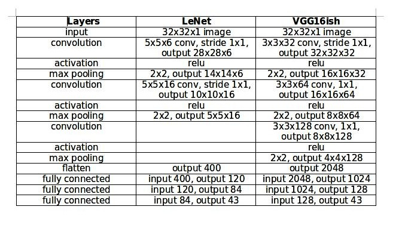


```python
### Define your architecture here.
### Feel free to use as many code cells as needed.
from tensorflow.contrib.layers import flatten

def LeNet(x, use_dropout=False):    
    # Arguments used for tf.truncated_normal, randomly defines variables for the weights and biases for each layer
    #mu = 0
    #sigma = 0.1
    
    # Layer 1: Convolutional. Input = 32x32x1. Output = 28x28x6.
    conv_w1 = tf.Variable(initializer(shape=(5, 5, 1, 6)))
    conv_b1 = tf.Variable(tf.zeros(6))
    conv_1 = tf.nn.conv2d(x, conv_w1, strides=[1,1,1,1], padding='VALID') + conv_b1

    # Activation.
    conv_1 = tf.nn.relu(conv_1)

    # Pooling. Input = 28x28x6. Output = 14x14x6.
    conv_1 = tf.nn.max_pool(conv_1, ksize=[1,2,2,1], strides=[1,2,2,1], padding='VALID')
    if use_dropout:
        conv_1 = tf.nn.dropout(conv_1, keep_prob)

    # Layer 2: Convolutional. Output = 10x10x16.
    conv_w2 = tf.Variable(initializer(shape=(5, 5, 6, 16)))
    conv_b2 = tf.Variable(tf.zeros(16))
    conv_2 = tf.nn.conv2d(conv_1, conv_w2, strides=[1,1,1,1], padding='VALID') + conv_b2
    
    # Activation.
    conv_2 = tf.nn.relu(conv_2)

    # Pooling. Input = 10x10x16. Output = 5x5x16.
    conv_2 = tf.nn.max_pool(conv_2, ksize=[1,2,2,1], strides=[1,2,2,1], padding='VALID')
    if use_dropout:
        conv_2 = tf.nn.dropout(conv_2, keep_prob)

    # Flatten. Input = 5x5x16. Output = 400.
    fc0 = flatten(conv_2)
    
    # Layer 3: Fully Connected. Input = 400. Output = 120.
    fc1_w = tf.Variable(initializer(shape=(400, 120)))
    fc1_b = tf.Variable(tf.zeros(120))
    fc1 = tf.add(tf.matmul(fc0, fc1_w), fc1_b)
    
    # Activation.
    fc1 = tf.nn.relu(fc1)
    if use_dropout:
        fc1 = tf.nn.dropout(fc1, keep_prob)

    # Layer 4: Fully Connected. Input = 120. Output = 84.
    fc2_w = tf.Variable(initializer(shape=(120, 84)))
    fc2_b = tf.Variable(tf.zeros(84))
    fc2 = tf.add(tf.matmul(fc1, fc2_w), fc2_b)
    
    # Activation.
    fc2 = tf.nn.relu(fc2)
    if use_dropout:
        fc2 = tf.nn.dropout(fc2, keep_prob)

    # Layer 5: Fully Connected. Input = 84. Output = n_classes.
    fc3_W  = tf.Variable(initializer(shape=(84, n_classes)))
    fc3_b  = tf.Variable(tf.zeros(n_classes))
    logits = tf.add(tf.matmul(fc2, fc3_W), fc3_b)
    
    return logits
```

### Train, Validate and Test the Model

A validation set can be used to assess how well the model is performing. A low accuracy on the training and validation
sets imply underfitting. A high accuracy on the training set but low accuracy on the validation set implies overfitting.


```python
### Train your model here.
### Calculate and report the accuracy on the training and validation set.
### Once a final model architecture is selected, 
### the accuracy on the test set should be calculated and reported as well.
### Feel free to use as many code cells as needed.
EPOCHS = 50
BATCH_SIZE = 128
rate = 1e-3
```


```python
x = tf.placeholder(tf.float32, (None, 32, 32, 1))
y = tf.placeholder(tf.int32, (None))
one_hot_y = tf.one_hot(y, n_classes)
keep_prob = tf.placeholder(tf.float32)
```

We use Adam optimizer and cross entropy loss. <br>
I tried using SGD with momentum=0.9 to obtain similar validation and test accuracy <br>
Although Its removed from this submission<br>


```python
logits = LeNet(x, True)
cross_entropy = tf.nn.softmax_cross_entropy_with_logits_v2(labels=one_hot_y, logits=logits)
loss_operation = tf.reduce_mean(cross_entropy)
optimizer = tf.train.AdamOptimizer(learning_rate = rate)
training_operation = optimizer.minimize(loss_operation)
```


```python
correct_prediction = tf.equal(tf.argmax(logits, 1), tf.argmax(one_hot_y, 1))
accuracy_operation = tf.reduce_mean(tf.cast(correct_prediction, tf.float32))
saver = tf.train.Saver()
```


```python
def evaluate(X_data, y_data, prob=0):
    num_examples = len(X_data)
    total_accuracy = 0
    sess = tf.get_default_session()
    for offset in range(0, num_examples, BATCH_SIZE):
        batch_x, batch_y = X_data[offset:offset+BATCH_SIZE], y_data[offset:offset+BATCH_SIZE]
        if prob > 0:
            accuracy = sess.run(accuracy_operation, feed_dict={x: batch_x, y: batch_y, keep_prob:prob})
            loss = sess.run(loss_operation, feed_dict={x: batch_x, y: batch_y, keep_prob:prob})
        else:
            accuracy = sess.run(accuracy_operation, feed_dict={x: batch_x, y: batch_y})
            loss = sess.run(loss_operation, feed_dict={x: batch_x, y: batch_y})
        total_accuracy += (accuracy * len(batch_x))
    return total_accuracy / num_examples, loss
```


```python
global best_acc
best_acc= 0
```


```python
train_accs = []
valid_accs = []
train_losses = []
valid_losses = []
```


```python
with tf.Session() as sess:
    sess.run(tf.global_variables_initializer())
    
    print("Training...")
    print()
    train_loss = 0.0
    train_acc = 0.0
    for i in range(EPOCHS):
        for offset in range(0, n_train, BATCH_SIZE):
            end = offset + BATCH_SIZE
            batch_x, batch_y = X_train_preprocessed[offset:end], y_train_preprocessed[offset:end]
            batch_x = np.reshape(batch_x, (-1, 32, 32, 1))
            sess.run(training_operation, feed_dict={x: batch_x, y: batch_y, keep_prob:0.8})
            train_loss = sess.run(loss_operation, feed_dict={x: batch_x, y: batch_y, keep_prob:0.8})
            train_acc = sess.run(accuracy_operation, feed_dict={x: batch_x, y: batch_y, keep_prob:0.8})
            
        train_accs.append(train_acc)
        train_losses.append(train_loss)
        X_valid_reshaped = np.reshape(X_valid, (-1, 32, 32, 1))
        validation_accuracy, validation_loss = evaluate(X_valid_reshaped, y_valid, prob=1.0)
        valid_accs.append(validation_accuracy)
        valid_losses.append(validation_loss)
        if validation_accuracy > best_acc:
            best_acc = validation_accuracy
            saver.save(sess, './lenet')
            print("Model saved")
        
        print("EPOCH {} ...".format(i+1))
        print("Training Loss: {:.4f}, Training Accuracy = {:.3f}".format(train_loss, train_acc * 100))
        print("Validation Loss: {:.4f}, Validation Accuracy = {:.3f}".format(validation_loss, validation_accuracy*100))
        print()
```

    Training...
    
    Model saved
    EPOCH 1 ...
    Training Loss: 0.8392, Training Accuracy = 69.369
    Validation Loss: 0.4702, Validation Accuracy = 79.909
    
    Model saved
    EPOCH 2 ...
    Training Loss: 0.4155, Training Accuracy = 86.486
    Validation Loss: 0.2225, Validation Accuracy = 89.887
    
    Model saved
    EPOCH 3 ...
    Training Loss: 0.3962, Training Accuracy = 89.189
    Validation Loss: 0.1748, Validation Accuracy = 92.449
    
    Model saved
    EPOCH 4 ...
    Training Loss: 0.3175, Training Accuracy = 89.189
    Validation Loss: 0.1167, Validation Accuracy = 93.628
    
    Model saved
    EPOCH 5 ...
    Training Loss: 0.2555, Training Accuracy = 93.694
    Validation Loss: 0.1164, Validation Accuracy = 94.308
    
    Model saved
    EPOCH 6 ...
    Training Loss: 0.2433, Training Accuracy = 91.892
    Validation Loss: 0.1139, Validation Accuracy = 95.057
    
    EPOCH 7 ...
    Training Loss: 0.1512, Training Accuracy = 94.595
    Validation Loss: 0.0926, Validation Accuracy = 94.943
    
    Model saved
    EPOCH 8 ...
    Training Loss: 0.1978, Training Accuracy = 92.793
    Validation Loss: 0.1106, Validation Accuracy = 95.125
    
    Model saved
    EPOCH 9 ...
    Training Loss: 0.1533, Training Accuracy = 94.595
    Validation Loss: 0.0776, Validation Accuracy = 95.533
    
    EPOCH 10 ...
    Training Loss: 0.1014, Training Accuracy = 96.396
    Validation Loss: 0.0720, Validation Accuracy = 95.306
    
    Model saved
    EPOCH 11 ...
    Training Loss: 0.1516, Training Accuracy = 94.595
    Validation Loss: 0.0644, Validation Accuracy = 95.669
    
    EPOCH 12 ...
    Training Loss: 0.2183, Training Accuracy = 97.297
    Validation Loss: 0.0533, Validation Accuracy = 95.624
    
    EPOCH 13 ...
    Training Loss: 0.1012, Training Accuracy = 98.198
    Validation Loss: 0.0481, Validation Accuracy = 95.533
    
    Model saved
    EPOCH 14 ...
    Training Loss: 0.1431, Training Accuracy = 96.396
    Validation Loss: 0.0445, Validation Accuracy = 95.896
    
    Model saved
    EPOCH 15 ...
    Training Loss: 0.0565, Training Accuracy = 97.297
    Validation Loss: 0.0407, Validation Accuracy = 96.395
    
    Model saved
    EPOCH 16 ...
    Training Loss: 0.0831, Training Accuracy = 97.297
    Validation Loss: 0.0423, Validation Accuracy = 96.485
    
    Model saved
    EPOCH 17 ...
    Training Loss: 0.0807, Training Accuracy = 98.198
    Validation Loss: 0.0528, Validation Accuracy = 96.644
    
    EPOCH 18 ...
    Training Loss: 0.0946, Training Accuracy = 93.694
    Validation Loss: 0.0420, Validation Accuracy = 96.621
    
    Model saved
    EPOCH 19 ...
    Training Loss: 0.0759, Training Accuracy = 98.198
    Validation Loss: 0.0294, Validation Accuracy = 96.735
    
    EPOCH 20 ...
    Training Loss: 0.0717, Training Accuracy = 97.297
    Validation Loss: 0.0275, Validation Accuracy = 96.508
    
    EPOCH 21 ...
    Training Loss: 0.1421, Training Accuracy = 98.198
    Validation Loss: 0.0307, Validation Accuracy = 96.508
    
    Model saved
    EPOCH 22 ...
    Training Loss: 0.1058, Training Accuracy = 98.198
    Validation Loss: 0.0370, Validation Accuracy = 96.803
    
    Model saved
    EPOCH 23 ...
    Training Loss: 0.0453, Training Accuracy = 97.297
    Validation Loss: 0.0226, Validation Accuracy = 96.825
    
    EPOCH 24 ...
    Training Loss: 0.0816, Training Accuracy = 97.297
    Validation Loss: 0.0278, Validation Accuracy = 96.689
    
    EPOCH 25 ...
    Training Loss: 0.0295, Training Accuracy = 94.595
    Validation Loss: 0.0175, Validation Accuracy = 96.644
    
    Model saved
    EPOCH 26 ...
    Training Loss: 0.0480, Training Accuracy = 96.396
    Validation Loss: 0.0309, Validation Accuracy = 96.893
    
    Model saved
    EPOCH 27 ...
    Training Loss: 0.1406, Training Accuracy = 97.297
    Validation Loss: 0.0182, Validation Accuracy = 97.166
    
    EPOCH 28 ...
    Training Loss: 0.0758, Training Accuracy = 99.099
    Validation Loss: 0.0165, Validation Accuracy = 96.712
    
    EPOCH 29 ...
    Training Loss: 0.0913, Training Accuracy = 95.495
    Validation Loss: 0.0193, Validation Accuracy = 96.417
    
    EPOCH 30 ...
    Training Loss: 0.1553, Training Accuracy = 97.297
    Validation Loss: 0.0248, Validation Accuracy = 96.780
    
    EPOCH 31 ...
    Training Loss: 0.0888, Training Accuracy = 96.396
    Validation Loss: 0.0096, Validation Accuracy = 96.190
    
    EPOCH 32 ...
    Training Loss: 0.0857, Training Accuracy = 96.396
    Validation Loss: 0.0133, Validation Accuracy = 96.395
    
    EPOCH 33 ...
    Training Loss: 0.0540, Training Accuracy = 98.198
    Validation Loss: 0.0151, Validation Accuracy = 96.939
    
    Model saved
    EPOCH 34 ...
    Training Loss: 0.1175, Training Accuracy = 96.396
    Validation Loss: 0.0079, Validation Accuracy = 97.234
    
    EPOCH 35 ...
    Training Loss: 0.0645, Training Accuracy = 98.198
    Validation Loss: 0.0383, Validation Accuracy = 96.803
    
    Model saved
    EPOCH 36 ...
    Training Loss: 0.0486, Training Accuracy = 98.198
    Validation Loss: 0.0098, Validation Accuracy = 97.347
    
    EPOCH 37 ...
    Training Loss: 0.0484, Training Accuracy = 92.793
    Validation Loss: 0.0119, Validation Accuracy = 96.893
    
    EPOCH 38 ...
    Training Loss: 0.0552, Training Accuracy = 98.198
    Validation Loss: 0.0305, Validation Accuracy = 97.007
    
    EPOCH 39 ...
    Training Loss: 0.0260, Training Accuracy = 97.297
    Validation Loss: 0.0179, Validation Accuracy = 97.166
    
    EPOCH 40 ...
    Training Loss: 0.1696, Training Accuracy = 99.099
    Validation Loss: 0.0141, Validation Accuracy = 96.961
    
    EPOCH 41 ...
    Training Loss: 0.0488, Training Accuracy = 96.396
    Validation Loss: 0.0171, Validation Accuracy = 96.440
    
    EPOCH 42 ...
    Training Loss: 0.0893, Training Accuracy = 96.396
    Validation Loss: 0.0096, Validation Accuracy = 97.029
    
    EPOCH 43 ...
    Training Loss: 0.0451, Training Accuracy = 96.396
    Validation Loss: 0.0345, Validation Accuracy = 97.120
    
    EPOCH 44 ...
    Training Loss: 0.1852, Training Accuracy = 96.396
    Validation Loss: 0.0224, Validation Accuracy = 97.120
    
    EPOCH 45 ...
    Training Loss: 0.1215, Training Accuracy = 95.495
    Validation Loss: 0.0056, Validation Accuracy = 97.120
    
    EPOCH 46 ...
    Training Loss: 0.0448, Training Accuracy = 97.297
    Validation Loss: 0.0095, Validation Accuracy = 97.029
    
    EPOCH 47 ...
    Training Loss: 0.1098, Training Accuracy = 96.396
    Validation Loss: 0.0161, Validation Accuracy = 97.234
    
    EPOCH 48 ...
    Training Loss: 0.0281, Training Accuracy = 98.198
    Validation Loss: 0.0167, Validation Accuracy = 96.644
    
    EPOCH 49 ...
    Training Loss: 0.0287, Training Accuracy = 96.396
    Validation Loss: 0.0111, Validation Accuracy = 97.188
    
    EPOCH 50 ...
    Training Loss: 0.0571, Training Accuracy = 97.297
    Validation Loss: 0.0123, Validation Accuracy = 97.029
    


```python
plt.plot(train_accs, color='red', label='Train')
plt.plot(valid_accs, color='blue', label='Valid')
plt.title('Accuracy')
plt.legend(loc='best')
plt.show()
```


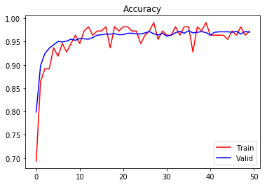


```python
plt.plot(train_losses, color='red', label='Train')
plt.plot(valid_losses, color='blue', label='Valid')
plt.title('Loss')
plt.legend(loc='best')
plt.show()
```


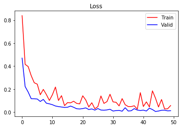


---

## Step 3: Test a Model on New Images

To give yourself more insight into how your model is working, download at least five pictures of German traffic signs from the web and use your model to predict the traffic sign type.

You may find `signnames.csv` useful as it contains mappings from the class id (integer) to the actual sign name.

### Analyze Performance


```python
### Calculate the accuracy for these 5 new images. 
### For example, if the model predicted 1 out of 5 signs correctly, it's 20% accurate on these new images.
with tf.Session() as sess:
    saver.restore(sess, tf.train.latest_checkpoint('.'))
    test_reshaped = np.reshape(X_test, (-1, 32, 32, 1))
    test_accuracy, test_loss = evaluate(test_reshaped, y_test, 1.0)
    print("Test Loss = {:.4f}, Test Accuracy = {:.3f}".format(test_loss, test_accuracy * 100))
```

    WARNING:tensorflow:From /home/nachiket273/anaconda3/envs/tensorflow/lib/python3.7/site-packages/tensorflow/python/training/saver.py:1266: checkpoint_exists (from tensorflow.python.training.checkpoint_management) is deprecated and will be removed in a future version.
    Instructions for updating:
    Use standard file APIs to check for files with this prefix.
    INFO:tensorflow:Restoring parameters from ./lenet
    Test Loss = 0.0254, Test Accuracy = 96.287


# VGG16ish

Below we define VGG16ish network with 2 cov layers followed by max pooling<br>
Starting with 32 channels instead of 64 in vgg16 and end at 128 instead of 512 <br>
And 2 fc layers instead of 3 <br>
<br>
This model reaches more than 97.22% accuracy on test set in 50 epochs.


```python
def VGG16ish(x, use_dropout=False):
    #mu = 0
    #sigma = 0.1
    
    # Layer 1 (Convolutional): Input = 32x32x1. Output = 32x32x32.
    conv_w1 = tf.Variable(initializer(shape=(3, 3, 1, 32)))
    conv_b1 = tf.Variable(tf.zeros(32))
    conv_1 = tf.nn.conv2d(x, conv_w1, strides=[1,1,1,1], padding='SAME', name='conv1') + conv_b1
    
    #Activation
    conv_1 = tf.nn.relu(conv_1, name='relu1')
    
    # Layer 3 (Pooling): Input = 32x32x32. Output = 16x16x32
    conv_2 = tf.nn.max_pool(conv_1, ksize=[1,2,2,1], strides=[1,2,2,1], padding='VALID')
    if use_dropout:
        conv_2 = tf.nn.dropout(conv_2, keep_prob)
    
    # Layer 4 (Convolutional): Input = 16x16x32. Output = 16x16x64.
    conv_w3 = tf.Variable(initializer(shape=(3, 3, 32, 64)))
    conv_b3 = tf.Variable(tf.zeros(64))
    conv_3 = tf.nn.conv2d(conv_2, conv_w3, strides=[1,1,1,1], padding='SAME', name='conv3') + conv_b3
    
    #Activation
    conv_3 = tf.nn.relu(conv_3, name='relu3')
    
    # Layer 5 (Convolutional): Input = 16x16x64. Output = 16x16x64.
    #conv_w4 = tf.Variable(initializer(shape=(3, 3, 64, 64)))
    #conv_b4 = tf.Variable(tf.zeros(64))
    #conv_4 = tf.nn.conv2d(conv_3, conv_w4, strides=[1,1,1,1], padding='SAME', name='conv4') + conv_b4
    
    #Activation
    #conv_4 = tf.nn.relu(conv_4, name='relu4')
    
    # Layer 6 (Pooling): Input = 16x16x64. Output = 8x8x64.
    conv_4 = tf.nn.max_pool(conv_3, ksize=[1,2,2,1], strides=[1,2,2,1], padding='VALID')
    if use_dropout:
        conv_4 = tf.nn.dropout(conv_4, keep_prob)
    
    # Layer 7 (Convolutional): Input = 8x8x64. Output = 8x8x128.
    conv_w5 = tf.Variable(initializer(shape=(3, 3, 64, 128)))
    conv_b5 = tf.Variable(tf.zeros(128))
    conv_5 = tf.nn.conv2d(conv_4, conv_w5, strides=[1,1,1,1], padding='SAME', name='conv5') + conv_b5
    
    #Activation
    conv_5 = tf.nn.relu(conv_5, name='relu5')
    
    # Layer 8 (Convolutional): Input = 8x8x128. Output = 8x8x128.
    #conv_w6 = tf.Variable(initializer(shape=(3, 3, 128, 128)))
    #conv_b6 = tf.Variable(tf.zeros(128))
    #conv_6 = tf.nn.conv2d(conv_5, conv_w6, strides=[1,1,1,1], padding='SAME') + conv_b6
    
    #Activation
    #conv_6 = tf.nn.relu(conv_6)
    
    # Layer 9 (Pooling): Input = 8x8x128. Output = 4x4x128.
    conv_6 = tf.nn.max_pool(conv_5, ksize=[1,2,2,1], strides=[1,2,2,1], padding='VALID')
    if use_dropout:
        conv_6 = tf.nn.dropout(conv_6, keep_prob)
    
    # Flatten. Input = 4x4x128. Output = 2048.
    fc0 = flatten(conv_6)
    
    # Layer 10 (Fully Connected): Input = 2048. Output = 1024.
    fc1_w = tf.Variable(initializer(shape=(2048, 1024)))
    fc1_b = tf.Variable(tf.zeros(1024))
    fc1 = tf.add(tf.matmul(fc0, fc1_w), fc1_b)
    
    # Activation
    fc1 = tf.nn.relu(fc1)
    if use_dropout:
        fc1 = tf.nn.dropout(fc1, keep_prob)
    
    # Layer 11 (Fully Connected): Input = 1024. Output = 128.
    fc2_w = tf.Variable(initializer(shape=(1024, 128)))
    fc2_b = tf.Variable(tf.zeros(128))
    fc2 = tf.add(tf.matmul(fc1, fc2_w), fc2_b)
    
    # Activation
    fc2 = tf.nn.relu(fc2)
    if use_dropout:
        fc2 = tf.nn.dropout(fc2, keep_prob)
    
    # Layer 12 (Fully Connected): Input = 128. Output = n_classes
    fc3_w = tf.Variable(initializer(shape=(128, n_classes)))
    fc3_b = tf.Variable(tf.zeros(n_classes))
    logits = tf.add(tf.matmul(fc2, fc3_w), fc3_b)
    
    global network_params
    network_params = {
        "conv1": conv_1,
        "conv3": conv_3,
        "conv5": conv_5,
        "fc0": fc0,
        "fc1": fc1,
        "fc2": fc2,
        "logits": logits
    }
    
    return logits
```


```python
logits = VGG16ish(x, use_dropout=True)
```


```python
cross_entropy = tf.nn.softmax_cross_entropy_with_logits(labels=one_hot_y, logits=logits)
loss_operation = tf.reduce_mean(cross_entropy)
optimizer = tf.train.AdamOptimizer(learning_rate = rate)
training_operation = optimizer.minimize(loss_operation)
correct_prediction = tf.equal(tf.argmax(logits, 1), tf.argmax(one_hot_y, 1))
accuracy_operation = tf.reduce_mean(tf.cast(correct_prediction, tf.float32))
saver = tf.train.Saver()
```


```python
EPOCHS = 50
best_acc = 0.0
```


```python
train_accs = []
valid_accs = []
train_losses = []
valid_losses = []
```


```python
with tf.Session() as sess:
    sess.run(tf.global_variables_initializer())
    
    print("Training...")
    print()
    train_acc = 0.0
    train_loss = 0.0
    for i in range(EPOCHS):
        for offset in range(0, n_train, BATCH_SIZE):
            end = offset + BATCH_SIZE
            batch_x, batch_y = X_train_preprocessed[offset:end], y_train_preprocessed[offset:end]
            batch_x = np.reshape(batch_x, (-1, 32, 32, 1))
            sess.run(training_operation, feed_dict={x: batch_x, y: batch_y, keep_prob:0.6})
            train_loss = sess.run(loss_operation, feed_dict={x: batch_x, y: batch_y, keep_prob:0.6})
            train_acc = sess.run(accuracy_operation, feed_dict={x: batch_x, y: batch_y, keep_prob:0.6})
            
        train_accs.append(train_acc)
        train_losses.append(train_loss)            
        X_valid_reshaped = np.reshape(X_valid, (-1, 32, 32, 1))
        validation_accuracy, validation_loss = evaluate(X_valid_reshaped, y_valid, 1.0)
        valid_accs.append(validation_accuracy)
        valid_losses.append(validation_loss)
        if validation_accuracy > best_acc:
            best_acc = validation_accuracy
            saver.save(sess, './vgg16ish')
            print("Model saved")

        print("EPOCH {} ...".format(i+1))
        print("Training Loss: {:.4f}, Training Accuracy = {:.3f}".format(train_loss, train_acc * 100))
        print("Validation Loss: {:.4f}, Validation Accuracy = {:.3f}".format(validation_loss, validation_accuracy*100))
        print()
```

    Training...
    
    Model saved
    EPOCH 1 ...
    Training Loss: 1.2096, Training Accuracy = 65.766
    Validation Loss: 0.7957, Validation Accuracy = 70.181
    
    Model saved
    EPOCH 2 ...
    Training Loss: 0.5617, Training Accuracy = 81.982
    Validation Loss: 0.2820, Validation Accuracy = 87.211
    
    Model saved
    EPOCH 3 ...
    Training Loss: 0.4776, Training Accuracy = 87.387
    Validation Loss: 0.0952, Validation Accuracy = 94.762
    
    Model saved
    EPOCH 4 ...
    Training Loss: 0.2622, Training Accuracy = 94.595
    Validation Loss: 0.0531, Validation Accuracy = 96.168
    
    EPOCH 5 ...
    Training Loss: 0.2119, Training Accuracy = 93.694
    Validation Loss: 0.0423, Validation Accuracy = 96.009
    
    Model saved
    EPOCH 6 ...
    Training Loss: 0.1002, Training Accuracy = 92.793
    Validation Loss: 0.0550, Validation Accuracy = 96.803
    
    Model saved
    EPOCH 7 ...
    Training Loss: 0.1385, Training Accuracy = 92.793
    Validation Loss: 0.0459, Validation Accuracy = 97.415
    
    EPOCH 8 ...
    Training Loss: 0.1080, Training Accuracy = 97.297
    Validation Loss: 0.0365, Validation Accuracy = 97.075
    
    Model saved
    EPOCH 9 ...
    Training Loss: 0.1019, Training Accuracy = 95.495
    Validation Loss: 0.0426, Validation Accuracy = 97.460
    
    Model saved
    EPOCH 10 ...
    Training Loss: 0.1426, Training Accuracy = 97.297
    Validation Loss: 0.0308, Validation Accuracy = 97.506
    
    EPOCH 11 ...
    Training Loss: 0.0719, Training Accuracy = 98.198
    Validation Loss: 0.0512, Validation Accuracy = 97.075
    
    EPOCH 12 ...
    Training Loss: 0.0844, Training Accuracy = 97.297
    Validation Loss: 0.0478, Validation Accuracy = 97.506
    
    Model saved
    EPOCH 13 ...
    Training Loss: 0.0404, Training Accuracy = 98.198
    Validation Loss: 0.0282, Validation Accuracy = 97.506
    
    EPOCH 14 ...
    Training Loss: 0.1173, Training Accuracy = 96.396
    Validation Loss: 0.0207, Validation Accuracy = 97.506
    
    EPOCH 15 ...
    Training Loss: 0.0894, Training Accuracy = 92.793
    Validation Loss: 0.0372, Validation Accuracy = 97.506
    
    EPOCH 16 ...
    Training Loss: 0.0780, Training Accuracy = 96.396
    Validation Loss: 0.0592, Validation Accuracy = 97.234
    
    EPOCH 17 ...
    Training Loss: 0.0745, Training Accuracy = 96.396
    Validation Loss: 0.0604, Validation Accuracy = 97.483
    
    Model saved
    EPOCH 18 ...
    Training Loss: 0.0813, Training Accuracy = 94.595
    Validation Loss: 0.0208, Validation Accuracy = 97.619
    
    Model saved
    EPOCH 19 ...
    Training Loss: 0.0814, Training Accuracy = 98.198
    Validation Loss: 0.0188, Validation Accuracy = 97.846
    
    Model saved
    EPOCH 20 ...
    Training Loss: 0.1162, Training Accuracy = 96.396
    Validation Loss: 0.0321, Validation Accuracy = 97.937
    
    EPOCH 21 ...
    Training Loss: 0.0377, Training Accuracy = 98.198
    Validation Loss: 0.0302, Validation Accuracy = 97.664
    
    EPOCH 22 ...
    Training Loss: 0.0504, Training Accuracy = 97.297
    Validation Loss: 0.0756, Validation Accuracy = 97.710
    
    EPOCH 23 ...
    Training Loss: 0.0540, Training Accuracy = 99.099
    Validation Loss: 0.1276, Validation Accuracy = 97.710
    
    EPOCH 24 ...
    Training Loss: 0.0402, Training Accuracy = 97.297
    Validation Loss: 0.1021, Validation Accuracy = 97.710
    
    EPOCH 25 ...
    Training Loss: 0.0423, Training Accuracy = 98.198
    Validation Loss: 0.0936, Validation Accuracy = 97.596
    
    Model saved
    EPOCH 26 ...
    Training Loss: 0.0404, Training Accuracy = 100.000
    Validation Loss: 0.0320, Validation Accuracy = 98.027
    
    Model saved
    EPOCH 27 ...
    Training Loss: 0.0210, Training Accuracy = 100.000
    Validation Loss: 0.0901, Validation Accuracy = 98.118
    
    EPOCH 28 ...
    Training Loss: 0.0796, Training Accuracy = 97.297
    Validation Loss: 0.0792, Validation Accuracy = 97.937
    
    EPOCH 29 ...
    Training Loss: 0.0687, Training Accuracy = 95.495
    Validation Loss: 0.0734, Validation Accuracy = 97.891
    
    EPOCH 30 ...
    Training Loss: 0.0874, Training Accuracy = 99.099
    Validation Loss: 0.0766, Validation Accuracy = 97.664
    
    EPOCH 31 ...
    Training Loss: 0.0626, Training Accuracy = 98.198
    Validation Loss: 0.0318, Validation Accuracy = 97.982
    
    EPOCH 32 ...
    Training Loss: 0.0597, Training Accuracy = 100.000
    Validation Loss: 0.0132, Validation Accuracy = 98.027
    
    EPOCH 33 ...
    Training Loss: 0.0574, Training Accuracy = 97.297
    Validation Loss: 0.0902, Validation Accuracy = 97.800
    
    EPOCH 34 ...
    Training Loss: 0.0129, Training Accuracy = 96.396
    Validation Loss: 0.0272, Validation Accuracy = 97.778
    
    EPOCH 35 ...
    Training Loss: 0.0424, Training Accuracy = 100.000
    Validation Loss: 0.1624, Validation Accuracy = 97.460
    
    EPOCH 36 ...
    Training Loss: 0.1478, Training Accuracy = 98.198
    Validation Loss: 0.1237, Validation Accuracy = 97.778
    
    EPOCH 37 ...
    Training Loss: 0.0641, Training Accuracy = 98.198
    Validation Loss: 0.0332, Validation Accuracy = 97.823
    
    EPOCH 38 ...
    Training Loss: 0.2030, Training Accuracy = 98.198
    Validation Loss: 0.0903, Validation Accuracy = 97.619
    
    EPOCH 39 ...
    Training Loss: 0.0449, Training Accuracy = 98.198
    Validation Loss: 0.0401, Validation Accuracy = 98.050
    
    EPOCH 40 ...
    Training Loss: 0.0112, Training Accuracy = 98.198
    Validation Loss: 0.0559, Validation Accuracy = 97.619
    
    EPOCH 41 ...
    Training Loss: 0.0836, Training Accuracy = 97.297
    Validation Loss: 0.1094, Validation Accuracy = 97.800
    
    EPOCH 42 ...
    Training Loss: 0.0108, Training Accuracy = 99.099
    Validation Loss: 0.1001, Validation Accuracy = 97.823
    
    EPOCH 43 ...
    Training Loss: 0.0526, Training Accuracy = 100.000
    Validation Loss: 0.0722, Validation Accuracy = 97.687
    
    EPOCH 44 ...
    Training Loss: 0.0738, Training Accuracy = 98.198
    Validation Loss: 0.0901, Validation Accuracy = 97.664
    
    EPOCH 45 ...
    Training Loss: 0.0289, Training Accuracy = 100.000
    Validation Loss: 0.1329, Validation Accuracy = 97.846
    
    EPOCH 46 ...
    Training Loss: 0.0549, Training Accuracy = 100.000
    Validation Loss: 0.0433, Validation Accuracy = 98.027
    
    EPOCH 47 ...
    Training Loss: 0.0887, Training Accuracy = 100.000
    Validation Loss: 0.0647, Validation Accuracy = 97.483
    
    EPOCH 48 ...
    Training Loss: 0.2185, Training Accuracy = 97.297
    Validation Loss: 0.1501, Validation Accuracy = 97.528
    
    EPOCH 49 ...
    Training Loss: 0.0400, Training Accuracy = 98.198
    Validation Loss: 0.1028, Validation Accuracy = 97.551
    
    EPOCH 50 ...
    Training Loss: 0.0572, Training Accuracy = 96.396
    Validation Loss: 0.0303, Validation Accuracy = 97.800
    


```python
plt.plot(train_accs, color='red', label='Train')
plt.plot(valid_accs, color='blue', label='Valid')
plt.title('Accuracy')
plt.legend(loc='best')
plt.show()
```


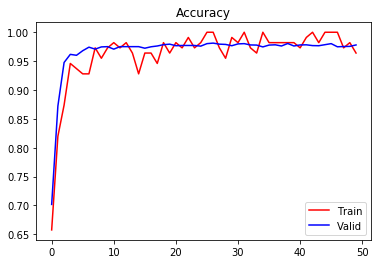


```python
plt.plot(train_losses, color='red', label='Train')
plt.plot(valid_losses, color='blue', label='Valid')
plt.title('Losses')
plt.legend(loc='best')
plt.show()
```


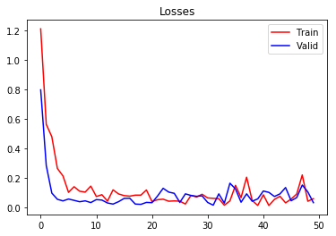


```python
with tf.Session() as sess:
    saver.restore(sess, tf.train.latest_checkpoint('.'))
    test_reshaped = np.reshape(X_test, (-1, 32, 32, 1))
    test_accuracy, test_loss = evaluate(test_reshaped, y_test, 1.0)
    print("Test Loss={:.4f}, Test Accuracy = {:.3f}".format(test_loss, test_accuracy * 100))
```

    INFO:tensorflow:Restoring parameters from ./vgg16ish
    Test Loss=0.0058, Test Accuracy = 97.229


### Output Top 5 Softmax Probabilities For Each Image Found on the Web

For each of the new images, print out the model's softmax probabilities to show the **certainty** of the model's predictions (limit the output to the top 5 probabilities for each image). [`tf.nn.top_k`](https://www.tensorflow.org/versions/r0.12/api_docs/python/nn.html#top_k) could prove helpful here. 

The example below demonstrates how tf.nn.top_k can be used to find the top k predictions for each image.

`tf.nn.top_k` will return the values and indices (class ids) of the top k predictions. So if k=3, for each sign, it'll return the 3 largest probabilities (out of a possible 43) and the correspoding class ids.

Take this numpy array as an example. The values in the array represent predictions. The array contains softmax probabilities for five candidate images with six possible classes. `tf.nn.top_k` is used to choose the three classes with the highest probability:

```
# (5, 6) array
a = np.array([[ 0.24879643,  0.07032244,  0.12641572,  0.34763842,  0.07893497,
         0.12789202],
       [ 0.28086119,  0.27569815,  0.08594638,  0.0178669 ,  0.18063401,
         0.15899337],
       [ 0.26076848,  0.23664738,  0.08020603,  0.07001922,  0.1134371 ,
         0.23892179],
       [ 0.11943333,  0.29198961,  0.02605103,  0.26234032,  0.1351348 ,
         0.16505091],
       [ 0.09561176,  0.34396535,  0.0643941 ,  0.16240774,  0.24206137,
         0.09155967]])
```

Running it through `sess.run(tf.nn.top_k(tf.constant(a), k=3))` produces:

```
TopKV2(values=array([[ 0.34763842,  0.24879643,  0.12789202],
       [ 0.28086119,  0.27569815,  0.18063401],
       [ 0.26076848,  0.23892179,  0.23664738],
       [ 0.29198961,  0.26234032,  0.16505091],
       [ 0.34396535,  0.24206137,  0.16240774]]), indices=array([[3, 0, 5],
       [0, 1, 4],
       [0, 5, 1],
       [1, 3, 5],
       [1, 4, 3]], dtype=int32))
```

Looking just at the first row we get `[ 0.34763842,  0.24879643,  0.12789202]`, you can confirm these are the 3 largest probabilities in `a`. You'll also notice `[3, 0, 5]` are the corresponding indices.

### Predict the Sign Type for Each Image


```python
### Run the predictions here and use the model to output the prediction for each image.
### Make sure to pre-process the images with the same pre-processing pipeline used earlier.
### Feel free to use as many code cells as needed.
def predict(test_x, top_k=1):
    num_examples = len(test_x)
    y_pred = np.zeros((num_examples, top_k), dtype=np.int32)
    y_prob = np.zeros((num_examples, top_k))
    top_5 = tf.nn.top_k(tf.nn.softmax(logits), k=top_k, sorted=True)
    with tf.Session() as sess:
        saver.restore(sess, './vgg16ish')
        y_prob, y_pred = sess.run(top_5, feed_dict={x:test_x, keep_prob:1.0})
    return y_prob, y_pred
```


```python
import os
list_of_imgs = []
test_dir = 'test/'
for image_name in os.listdir(test_dir):
    image = str(test_dir) + str(image_name)
    img = cv2.imread(image)
    img = cv2.cvtColor(img, cv2.COLOR_BGR2RGB)
    print(img.shape)
    list_of_imgs.append(img)
```

    (186, 200, 3)
    (300, 400, 3)
    (340, 604, 3)
    (460, 612, 3)
    (227, 222, 3)


```python
for img in list_of_imgs:
    resized_image = cv2.resize(img, (32, 32))
    processed_img = normalize(clahe(gray_scale(resized_image)))
    fg, ax = plt.subplots(nrows=1, ncols=2, figsize=(4,4))
    ax[0].imshow(resized_image)
    ax[1].imshow(processed_img, cmap='gray')
```


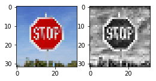


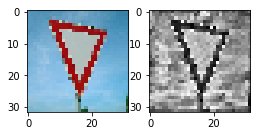


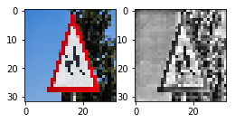


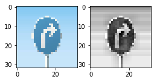


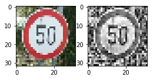


```python
list_of_labels = []
list_of_preds = []
list_of_probs = []
for img in list_of_imgs:
    resized_image = cv2.resize(img, (32, 32), interpolation=cv2.INTER_NEAREST)
    processed_img = normalize(equalize(gray_scale(resized_image)))
    reshaped_img = np.reshape(processed_img, (-1, 32, 32, 1))
    probs, preds = predict(reshaped_img, 5)
    print(np.ndarray.flatten(preds))
    print(np.ndarray.flatten(probs))
    list_of_preds.append(np.ndarray.flatten(preds))
    labels = []
    for pred in np.ndarray.flatten(preds):
        labels.append(id_to_sign_names[pred])
    list_of_labels.append(labels)
    list_of_probs.append(np.ndarray.flatten(probs))
```

    INFO:tensorflow:Restoring parameters from ./vgg16ish
    [ 5  6  7 14  3]
    [0.38097593 0.37939098 0.0973128  0.0687326  0.01917444]
    INFO:tensorflow:Restoring parameters from ./vgg16ish
    [13 15 12 35  1]
    [1.0000000e+00 5.0561996e-11 2.5004141e-11 4.4647684e-12 6.8223969e-13]
    INFO:tensorflow:Restoring parameters from ./vgg16ish
    [28 11 30 24 20]
    [0.9722889  0.01492133 0.00522271 0.00223398 0.00115484]
    INFO:tensorflow:Restoring parameters from ./vgg16ish
    [33 39 35 14  3]
    [9.9999964e-01 6.1611495e-08 5.9959469e-08 5.9572454e-08 8.4612024e-09]
    INFO:tensorflow:Restoring parameters from ./vgg16ish
    [2 5 3 1 4]
    [9.9357611e-01 2.6434178e-03 2.4364933e-03 1.1637198e-03 7.8955934e-05]


```python
actual_labels = np.array([14, 13, 28, 33, 2])
```


```python
list_of_labels
```


    [['Speed limit (80km/h)',
      'End of speed limit (80km/h)',
      'Speed limit (100km/h)',
      'Stop',
      'Speed limit (60km/h)'],
     ['Yield',
      'No vehicles',
      'Priority road',
      'Ahead only',
      'Speed limit (30km/h)'],
     ['Children crossing',
      'Right-of-way at the next intersection',
      'Beware of ice/snow',
      'Road narrows on the right',
      'Dangerous curve to the right'],
     ['Turn right ahead',
      'Keep left',
      'Ahead only',
      'Stop',
      'Speed limit (60km/h)'],
     ['Speed limit (50km/h)',
      'Speed limit (80km/h)',
      'Speed limit (60km/h)',
      'Speed limit (30km/h)',
      'Speed limit (70km/h)']]


```python
list_of_probs
```


    [array([0.38097593, 0.37939098, 0.0973128 , 0.0687326 , 0.01917444],
           dtype=float32),
     array([1.0000000e+00, 5.0561996e-11, 2.5004141e-11, 4.4647684e-12,
            6.8223969e-13], dtype=float32),
     array([0.9722889 , 0.01492133, 0.00522271, 0.00223398, 0.00115484],
           dtype=float32),
     array([9.9999964e-01, 6.1611495e-08, 5.9959469e-08, 5.9572454e-08,
            8.4612024e-09], dtype=float32),
     array([9.9357611e-01, 2.6434178e-03, 2.4364933e-03, 1.1637198e-03,
            7.8955934e-05], dtype=float32)]


```python
### Print out the top five softmax probabilities for the predictions on the German traffic sign images found on the web. 
### Feel free to use as many code cells as needed.
def show_imgs_softmax_probs(imgs, lb_names, probs, fig_size=(20, 10)):
    rows = len(imgs)
    fg, ax = plt.subplots(nrows=rows, ncols=2, figsize=fig_size)
    for i, prob_lb in enumerate(lb_names):
        img = imgs[i]
        ax[i,0].imshow(img)

        y_pos = np.arange(len(prob_lb))
        for j in range(0, len(prob_lb)):
            if j == 0:
                color = 'green'
            else:
                color = 'red'
            ax[i, 1].barh(j, probs[i][j], color=color, label="{0}".format(prob_lb[j]))

        ax[i, 1].set_yticks(y_pos)
        ax[i, 1].set_yticklabels(prob_lb)
        ax[i, 1].invert_yaxis()
        ax[i, 1].set_xlabel('Class')
        ax[i, 1].set_title('Softmax')  
        ax[i, 1].set_xscale('log')
    
    fg.tight_layout()
    plt.show()
```


```python
show_imgs_softmax_probs(list_of_imgs, list_of_labels, list_of_probs)
```


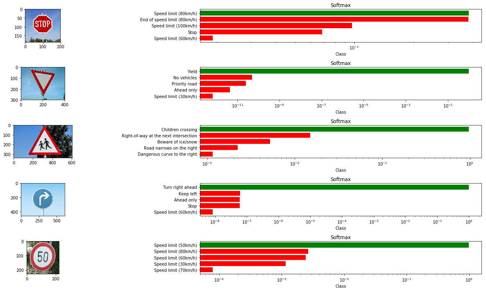


```python
my_preds = np.array(list_of_preds)
my_preds
```


    array([[ 5,  6,  7, 14,  3],
           [13, 15, 12, 35,  1],
           [28, 11, 30, 24, 20],
           [33, 39, 35, 14,  3],
           [ 2,  5,  3,  1,  4]], dtype=int32)


```python
acc = 0.0
nos = len(actual_labels)
for i, pred in enumerate(my_preds):
    if actual_labels[i] in pred:
        acc += 1
        
top5_acc = acc / nos * 100
top5_acc
```


    100.0


```python
acc = 0.0
nos = len(actual_labels)
for i, pred in enumerate(my_preds):
    if actual_labels[i] == pred[0]:
        acc += 1
        
top1_acc = acc / nos * 100
top1_acc
```


    80.0


Here although top-5 accuracy is 100% , but the first prediction for stop sign is wrong<br>
The model predicts it to be 'speed limit(80km/h)' , the second closest prediction is <br>
'end of speed limit(80km/h)'. <br>

# Testing on images downloaded from web

I downloaded 5 images from web and used trained vgg16ish model to predict top 5 outputs for each image <br>
the two images that need attention above are the first image, which is recognized as yeild , when its stop sign<br>
Stop sign is not even in first 5 prediction. <br>
<br>
This is most probably because the training images are well centered and cropped, while in this image <br>
the sign is towards right edge and have other things in background. <br>
One of the thing that can fix this is more augmentation. Specifically like rotating images , random crops etc <br>
<br>
The second image is the last image, which is not from the 43 signs from training dataset so its expected to fail. <br>
But, it predicts children crossing , which is quiet similar.

### Project Writeup

Once you have completed the code implementation, document your results in a project writeup using this [template](https://github.com/udacity/CarND-Traffic-Sign-Classifier-Project/blob/master/writeup_template.md) as a guide. The writeup can be in a markdown or pdf file. 

> **Note**: Once you have completed all of the code implementations and successfully answered each question above, you may finalize your work by exporting the iPython Notebook as an HTML document. You can do this by using the menu above and navigating to  \n",
    "**File -> Download as -> HTML (.html)**. Include the finished document along with this notebook as your submission.

---

## Step 4 (Optional): Visualize the Neural Network's State with Test Images

 This Section is not required to complete but acts as an additional excersise for understaning the output of a neural network's weights. While neural networks can be a great learning device they are often referred to as a black box. We can understand what the weights of a neural network look like better by plotting their feature maps. After successfully training your neural network you can see what it's feature maps look like by plotting the output of the network's weight layers in response to a test stimuli image. From these plotted feature maps, it's possible to see what characteristics of an image the network finds interesting. For a sign, maybe the inner network feature maps react with high activation to the sign's boundary outline or to the contrast in the sign's painted symbol.

 Provided for you below is the function code that allows you to get the visualization output of any tensorflow weight layer you want. The inputs to the function should be a stimuli image, one used during training or a new one you provided, and then the tensorflow variable name that represents the layer's state during the training process, for instance if you wanted to see what the [LeNet lab's](https://classroom.udacity.com/nanodegrees/nd013/parts/fbf77062-5703-404e-b60c-95b78b2f3f9e/modules/6df7ae49-c61c-4bb2-a23e-6527e69209ec/lessons/601ae704-1035-4287-8b11-e2c2716217ad/concepts/d4aca031-508f-4e0b-b493-e7b706120f81) feature maps looked like for it's second convolutional layer you could enter conv2 as the tf_activation variable.

For an example of what feature map outputs look like, check out NVIDIA's results in their paper [End-to-End Deep Learning for Self-Driving Cars](https://devblogs.nvidia.com/parallelforall/deep-learning-self-driving-cars/) in the section Visualization of internal CNN State. NVIDIA was able to show that their network's inner weights had high activations to road boundary lines by comparing feature maps from an image with a clear path to one without. Try experimenting with a similar test to show that your trained network's weights are looking for interesting features, whether it's looking at differences in feature maps from images with or without a sign, or even what feature maps look like in a trained network vs a completely untrained one on the same sign image.

<figure>
 
 <figcaption>
 <p></p> 
 <p style="text-align: center;"> Your output should look something like this (above)</p> 
 </figcaption>
</figure>
 <p></p> 


```python
### Visualize your network's feature maps here.
### Feel free to use as many code cells as needed.

# image_input: the test image being fed into the network to produce the feature maps
# tf_activation: should be a tf variable name used during your training procedure that represents the calculated state of a specific weight layer
# activation_min/max: can be used to view the activation contrast in more detail, by default matplot sets min and max to the actual min and max values of the output
# plt_num: used to plot out multiple different weight feature map sets on the same block, just extend the plt number for each new feature map entry

def outputFeatureMap(sess, image_input, tf_activation, activation_min=-1, activation_max=-1 ,plt_num=1):
    # Here make sure to preprocess your image_input in a way your network expects
    # with size, normalization, ect if needed
    # image_input =
    # Note: x should be the same name as your network's tensorflow data placeholder variable
    # If you get an error tf_activation is not defined it may be having trouble accessing the variable from inside a function
    activation = tf_activation.eval(session=sess,feed_dict={x : image_input})
    featuremaps = activation.shape[3]
    plt.figure(plt_num, figsize=(15,15))
    for featuremap in range(featuremaps):
        plt.subplot(6,8, featuremap+1) # sets the number of feature maps to show on each row and column
        plt.title('FeatureMap ' + str(featuremap)) # displays the feature map number
        if activation_min != -1 & activation_max != -1:
            plt.imshow(activation[0,:,:, featuremap], interpolation="nearest", vmin =activation_min, vmax=activation_max, cmap="gray")
        elif activation_max != -1:
            plt.imshow(activation[0,:,:, featuremap], interpolation="nearest", vmax=activation_max, cmap="gray")
        elif activation_min !=-1:
            plt.imshow(activation[0,:,:, featuremap], interpolation="nearest", vmin=activation_min, cmap="gray")
        else:
            plt.imshow(activation[0,:,:, featuremap], interpolation="nearest", cmap="gray")
```


```python
resized_image = cv2.resize(list_of_imgs[1], (32, 32), interpolation=cv2.INTER_NEAREST)
processed_img = normalize(equalize(gray_scale(resized_image)))
reshaped_img = np.reshape(processed_img, (-1, 32, 32, 1))
```


```python
with tf.Session() as sess:
    saver.restore(sess, tf.train.latest_checkpoint('.'))
    outputFeatureMap(sess, reshaped_img, network_params['conv1'])
```

    INFO:tensorflow:Restoring parameters from ./vgg16ish


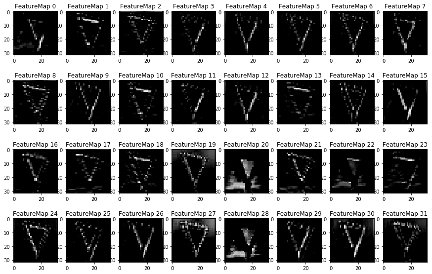

